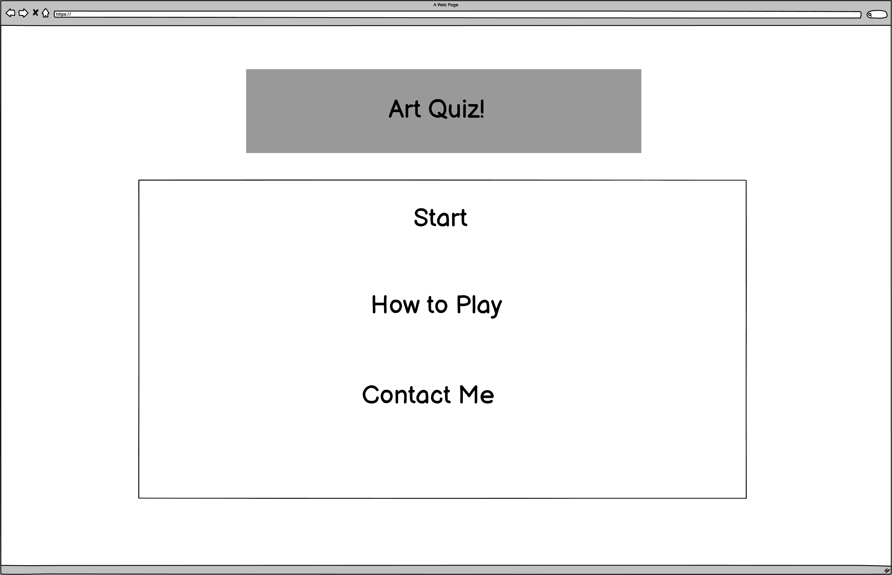
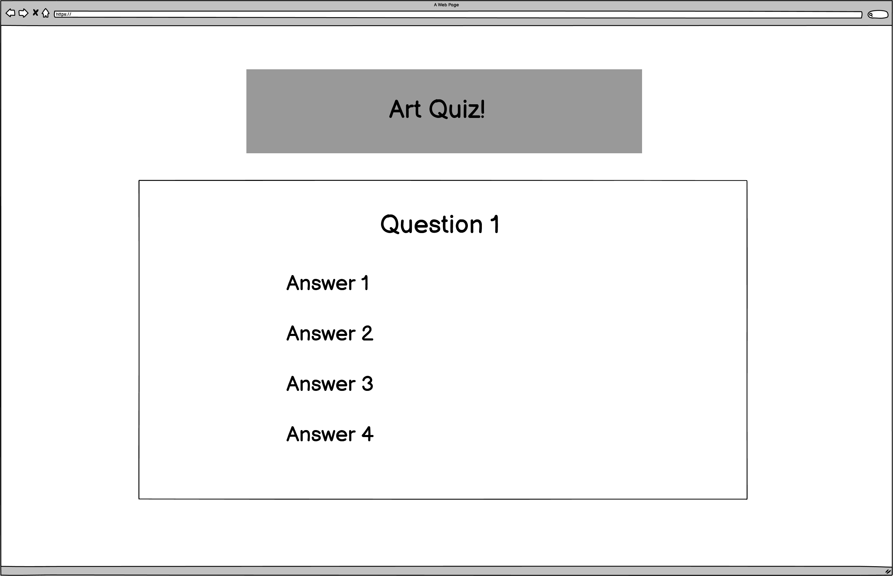
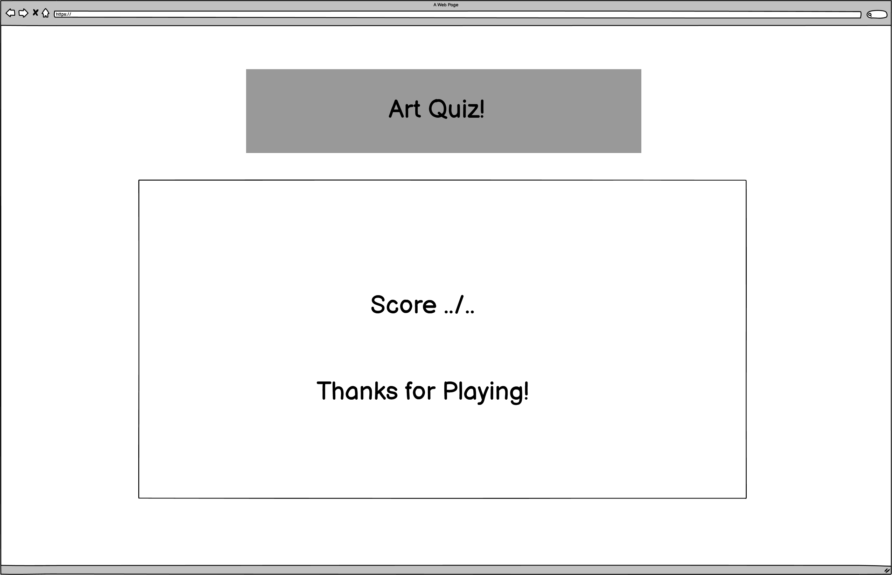
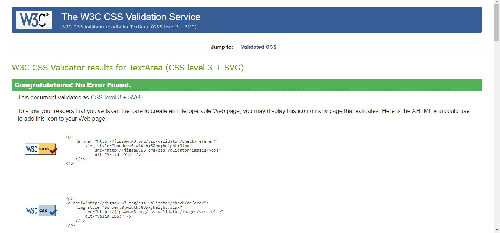
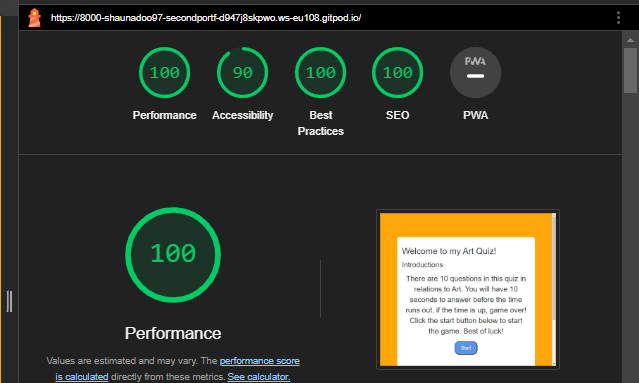

Welcome to my Art Quiz Test!
I've made a game quiz to test your knowledge on Art. 

## Users Stories 

## Wireframes 
Here are my wireframes:

## My Colour Schemes

 This is my colour scheme 

  

## Deployment 
My project was deployed by using the Github pages.

In order to get this done, here are the steps:

Firstly, go to the menu, and click the preffered repository

Click the settings button which can be easily identified by the gear icon in the menu right hand side.

On the left hand side, scroll down until pages are seen in the Code and automation.

In the build and deployment section, click the Branch and a dropdown menu will appear, and chose the main branch

Click save after this step and a confirmation of deployment should be confirmed shortly.

To know this, a green colored box with message is received saying "Your site is published at" with a web address. My website is live at : https://shaunadoo97.github.io/Second-Portfolio-ArtQuiz-/

## Testing and Code Validation 

Html testing so far, no errors 

css testing so far, no errors 

## Accessibility 
Testing so far from the Lighthouse accessibility

## Credits
### Codes so far 
I've used the css layout from https://www.youtube.com/watch?v=PBcqGxrr9g8&t=1396s
Guidance on Javascript using https://www.youtube.com/watch?v=riDzcEQbX6k
I've used reference from W3 Schools for timer function: 