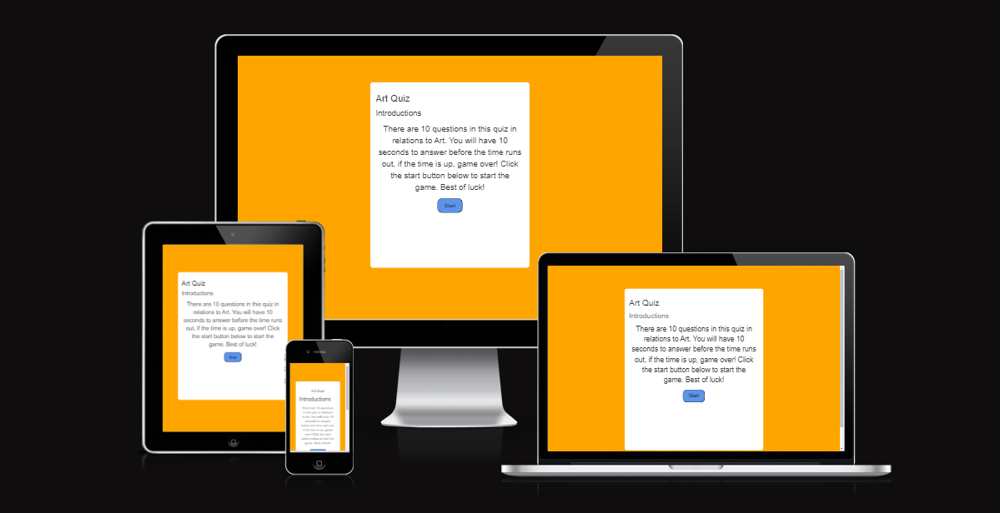
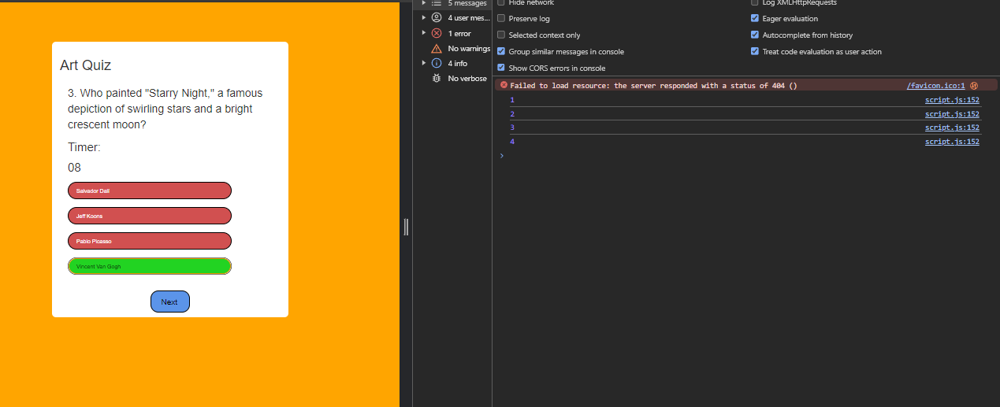
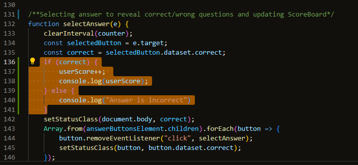
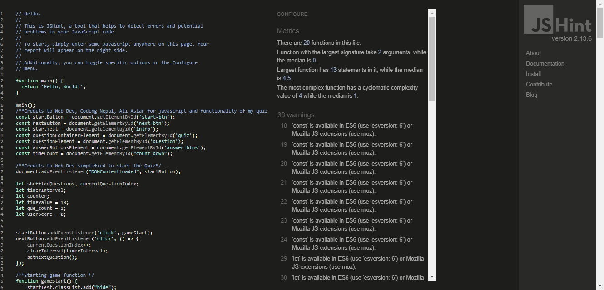

Welcome to my Art Quiz Test!
I've made a game quiz to test your knowledge on Art. 

# Contents 

[Introduction](#introduction  "Go to my-introduction")

[My Wireframes](#my-wireframes "Go to my-wireframes")

[My Colour Schemes](#my-colour-schemes "Go to my-colour-schemes")

[About my site](#about-my-site "Go to about-my-site")

[Testing and Code Validation](#testing-and-code-validation "Go to my-wireframes")

[Accessibility](#accessibility  "Go to my-accessibility")

[Deployment](#deployment "Go to my-deployment")

[Testing and Code Validation](#testing-and-code-validation "Go to testing-and-code-validation")

[Bugs and Issues](#bugs-and-issues "Got to bugs-and-issues")

[Credits and Codes](#credits-and-codes "Go to credits-and-codes")

## Introduction
An introduction to my website. A quiz that includes 10 questions all about Art being randomly displayed everytime when activated, in the end you will receieve the results to see how well you've done. 
My Art quiz is mostly aimed at Artists/Art students even visitors who can take a look and have a go for fun.

## My Goals as a new user
As a new user, I'd like to be introduced to the instrctions on the first page and have an idea what to expect before I click play. I would hope for this to be a fun experience aswell as learning a thing or two from the quiz about Art history. 
I would like to find out in the end on how well did I do, how many did I get right and an option to play again if I didn't do too good to beat my score.
I'd like to see a quit button to leave the game once I'm satisfied with my results after playing this game. 

## My Wireframes 
I had to re-design my wireframes from the previous original designs as they were too plain and basic. 
I created my rough ideas useing the Balsamiq Software
Here are my wireframes for both Website and Phone Page:

## My Colour Schemes

 This is my colour scheme 

  

## About my site
Introduction about my game 
I've made a quiz game based on art and to test your knowledge to see if you really know about your art!
The start of the home page includes an introduction, explaination about what to expect before you click the start button

After clicking the start button, it dives straight into the game setting the timer off

Once an option has been selected, it will reveal the correct answer based on the colours.
A number is also displayed to show what number question yopu are on beside the quiz.
The next button will also appear.

If you don't pick an option to answer and the timer runs out, it will reveal what the correct answer is.

Once you make it through ten questions, a result button will show. 

Once clicked, the results are revealed to show how many you got correct

I've also included two choices that can be made here. Either you can take the quiz game or leave it.

I also managed to include a cool little trick where you hover your mouse over the buttons, it will change colours.

## Future features and changes for my site:

-If I have time, I'd like to re-structure my quiz and include a "Play Game", "Instructions" and "Contact" all in one main menu. 

-I'd like to add in my social medias at the bottom of my site in the footer.

-I'd also like to resconsider changining the design of my site to make it feel more like artsy.

-I'd also like to add an image in some of my quiz e.g picture of Mona Lisa for the "Who painted Mona Lisa?" question.

-I'd like a send a message feature for users to get in touch on what they thought of the game or how if could improve it to make it look better

## Deployment 
My project was deployed by using the Github pages.

In order to get this done, here are the steps:

Firstly, go to the menu, and click the preffered repository

Click the settings button which can be easily identified by the gear icon in the menu right hand side.

On the left hand side, scroll down until pages are seen in the Code and automation.

In the build and deployment section, click the Branch and a dropdown menu will appear, and chose the main branch

Click save after this step and a confirmation of deployment should be confirmed shortly.

To know this, a green colored box with message is received saying "Your site is published at" with a web address. My website is live at : https://shaunadoo97.github.io/Second-Portfolio-ArtQuiz-/

## Bugs and Issues

Whilist working on my project, I had encountered so many bugs and issues in this project. I managed to solve them by asking my mentor for help, through research and YouTube what are the possible problems. 
Here are some Bugs and Issues I had to deal with:

Before pressing click to play, I had recieved an error where I did not define button as shown in the inspect section

I quickly resolved by fixing a simple mistake to declare it here.

Originally I had set the code to have Questions out of Current Questions being displayed at the bottom but decided to change it but I did have an issue.
It was coming up as "Objects"

I realised I didn't put in the right question value 

It wasn't showing as objects anymore. 

Another huge issue I had was the userScore. Everytime a right answer was selected, it dubilcates in the consol.log. 
For ages I couldn't understand as to why this was happening and i kept putting the 
if (correct) {
    userScore++;
    console.log(userScore)
}
on line 164 in js. After looking at some videos, some were putting this in their selectedAnswer() Function and this worked eventually. 
This is what Console.log looked in first place

I was only on question 3 and the number was showing a number ahead. When i clicked the right answer, it the plus 1 was added twice.

After fixing the issue 
With changing the userScore++ into the selectedAnswer(e), the scores add up whenever a right answer is clicked and userScore will be displayed at the end of game.

Other than the major bugs and issues, I've had little ones such as in the console.log to let me know whether I had forgotten to declare a variable or mispelled it. Also, some would be missing a semi-colon or if I had accidentally removed a curly bracket when needed to run the code properly. 
There was a few times my computer took a while to update to the point that I would have to restart it to let it catch up with the new updates I've applied to the code. 

## Testing and Code Validation 

Html testing so far, no errors 

css testing so far, no errors 

I had also tested JavaScript using JS.hint 
https://jshint.com/

These are the outcomes of this code:

Metrics
There are 20 functions in this file.

Function with the largest signature take 2 arguments, while the median is 0.

Largest function has 13 statements in it, while the median is 4.5.

The most complex function has a cyclomatic complexity value of 4 while the median is 1.

Although I do have 36 warnings but I don't appear to have the Moz extension on my computer. 

## Accessibility 
Testing so far from the Lighthouse accessibility

< 

## Credits and Codes
### Codes 
I've used the css layout from https://www.youtube.com/watch?v=PBcqGxrr9g8&t=1396s

I used these videos to put my Quiz together but altered in my own way combined as all videos were done differently:

https://www.youtube.com/watch?v=riDzcEQbX6k

https://www.youtube.com/watch?v=PBcqGxrr9g8

https://www.youtube.com/watch?v=xZXW5SnCiWI&t=3050s

https://www.youtube.com/watch?v=pQr4O1OITJo&t=2160s

I've used reference from W3 Schools for timer function: 

https://www.w3schools.com/

I got my random art quiz questions from 

https://chat.openai.com/ 

Also a special thanks to my mentor Rory Patrick who has helped and guided me through this project as it wasn't an easy one to get through. 