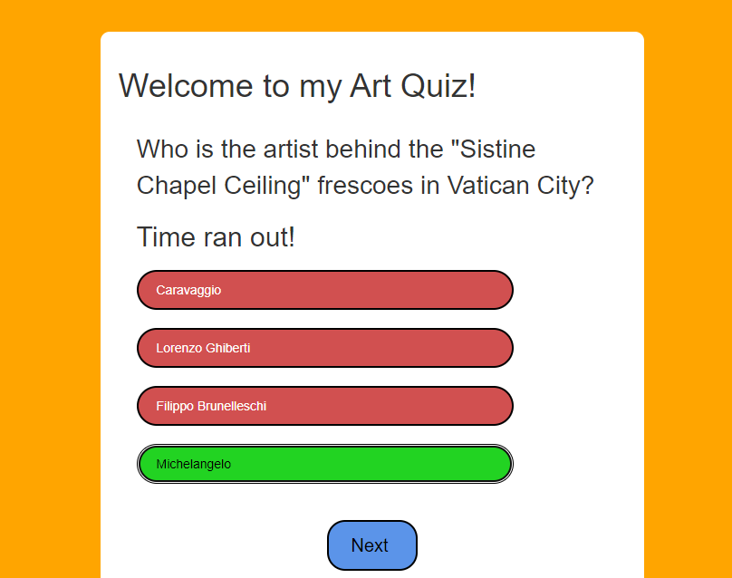

Welcome to my Art Quiz Test!
I've made a game quiz to test your knowledge on Art. 

# Contents 

[My Wireframes](#my-wireframes "Go to my-wireframes")

[My Colour Schemes](#my-colour-schemes "Go to my-colour-schemes")

[General](#general "Go to general")

[Testing and Code Validation](#testing-and-code-validation "Go to my-wireframes")

[Accessibility](#accessibility  "Go to my-accessibility")

[Deployment](#deployment "Go to my-deployment")

[Testing and Code Validation](#testing-and-code-validation "Go to testing-and-code-validation")

[Credits and Codes](#credits-and-codes "Go to credits-and-codes")

## My Wireframes 
Here are my wireframes for both Website and Phone Page:

## My Colour Schemes

 This is my colour scheme 

  

## General 
Introduction about my game 

Start of the home page 

this is when you hover your button over the start button 

Quiz startiing 

Quiz answers 
To show whether the person got a right or wrong answer

## Deployment 
My project was deployed by using the Github pages.

In order to get this done, here are the steps:

Firstly, go to the menu, and click the preffered repository

Click the settings button which can be easily identified by the gear icon in the menu right hand side.

On the left hand side, scroll down until pages are seen in the Code and automation.

In the build and deployment section, click the Branch and a dropdown menu will appear, and chose the main branch

Click save after this step and a confirmation of deployment should be confirmed shortly.

To know this, a green colored box with message is received saying "Your site is published at" with a web address. My website is live at : https://shaunadoo97.github.io/Second-Portfolio-ArtQuiz-/

## Additional Notes

unfortunately I did find Javascript a bit difficult and it took me a while to understand just how the functionalty works but with the limited time given, I wasm't able to do it in a way i wanted it done. I hope to come back to this and improve as much as I can. 

## Testing and Code Validation 

Html testing so far, no errors 

css testing so far, no errors 

## Accessibility 
Testing so far from the Lighthouse accessibility

< 

## Credits and Codes
### Codes so far 
I've used the css layout from https://www.youtube.com/watch?v=PBcqGxrr9g8&t=1396s
Guidance on Javascript using https://www.youtube.com/watch?v=riDzcEQbX6k
I've used reference from W3 Schools for timer function: https://www.w3schools.com/ 
I got my random art quiz questions from https://chat.openai.com/ 